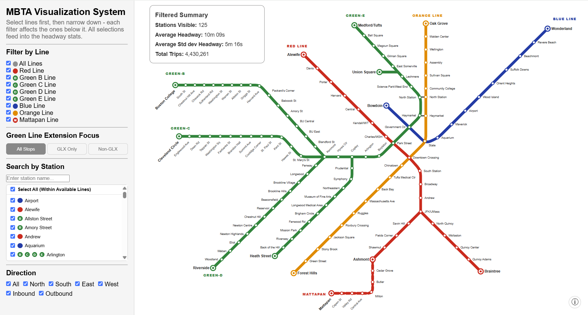
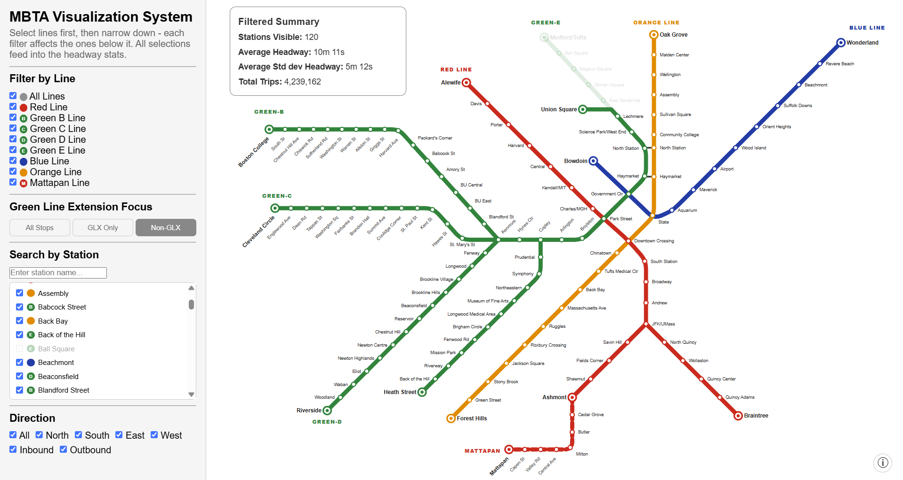
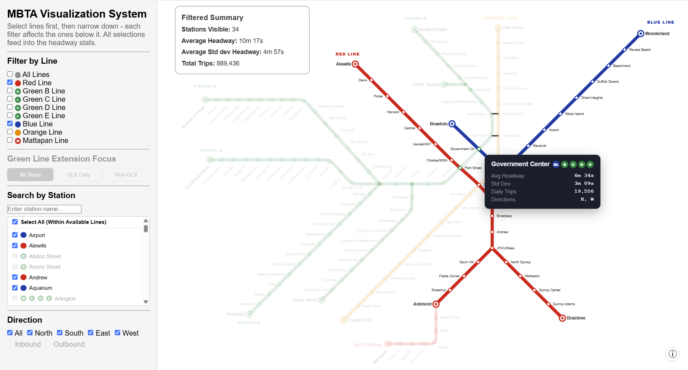

Yes. Given the actual code structure, I’d make the README explicitly distinguish **raw data (not committed)**, **cleaned data (generated)**, and the **DuckDB database (generated)**. I’d also make `directions_db.py` an optional utility rather than part of setup.

One caveat: the current `clean_headways.py` path behavior means the README below assumes you **place the cleaned output into `src/data/`** after running the cleaning script. If you later modify the script to write there automatically, that step can be simplified.

# MBTA Headway Visualization System

An interactive visualization system for exploring **MBTA subway and light rail headways** across stations, lines, and directions. The application combines cleaned MBTA headway data with an interactive map to help users investigate service frequency and variability across the transit network.

## Overview

This project was developed for **Tufts CS 178: Data Visualization** as a way to make MBTA service-frequency data easier to explore and interpret.

The visualization allows users to filter MBTA service by:

* **Transit line**
* **Station**
* **Direction**
* **Green Line Extension (GLX) vs. non-GLX stations**

Filters are applied hierarchically, with broader selections narrowing the available options for subsequent filters. This allows users to progressively focus on a specific portion of the transit network while avoiding incompatible filter combinations.

After applying filters, the application calculates summary statistics and displays station-level information directly on the map.

The backend uses **Flask** to serve the visualization and API endpoints, while **DuckDB** provides an efficient local analytical database for querying the headway data.

## Screenshots







## Features

### Interactive MBTA Map

The application displays MBTA stations on an interactive map and provides station-level information about service headways.

### Filtering

Users can filter the displayed data by:

* Red Line
* Orange Line
* Blue Line
* Green-B
* Green-C
* Green-D
* Green-E
* Mattapan Line
* Individual stations
* Direction
* GLX / non-GLX stations

Filters follow a hierarchy from **line → station → direction**, with GLX/non-GLX filtering available to further narrow the displayed stations. Available options update based on the selected filters to prevent incompatible combinations.

### Headway Statistics

For a selected set of filters, the application calculates:

* Number of stations visible
* Average headway
* Standard deviation of headway
* Total number of trips

Statistics are also calculated at the individual-station level and are used to provide information for map tooltips.

### Green Line Extension Analysis

The project gives particular attention to the **Green Line Extension (GLX)**. The five GLX stations included in the analysis are:

* Medford/Tufts
* Ball Square
* Magoun Square
* Gilman Square
* East Somerville

## Architecture

The application follows a data-processing and web-visualization pipeline:

```text
MBTA Headway CSV Data
        │
        ▼
Data Cleaning / Preprocessing
        │
        ▼
Cleaned Headway CSV
        │
        ▼
      DuckDB
        │
        ▼
   Flask Backend
        │
        ├── /api/headways
        ├── /api/directions
        └── /api/directions_by_line
        │
        ▼
 Interactive Frontend
        │
        ▼
     MBTA Map
```

## Data

The project uses the **MBTA Rapid Transit Headways** dataset published through the Massachusetts GIS data portal.

**Data source:**
[Massachusetts GIS — MBTA Rapid Transit Headways](https://gis.data.mass.gov/datasets/84c9d171d32945f594fbb4d889153c44/about)

The repository does **not** include the raw or cleaned CSV data because of its size. The data must be downloaded and processed locally before running the application.

The current preprocessing pipeline is configured for the **2025** dataset.

### Data Setup

Download the monthly 2025 MBTA headway CSV files from the Massachusetts GIS data portal and place them in:

```text
data/
└── Headways_2025/
    ├── 2025-01_Headway.csv
    ├── 2025-02_Headway.csv
    └── ...
```

The exact filenames may vary depending on the downloaded files, but the cleaning script expects the monthly files to contain the `Headway` data.

## Data Preprocessing

`clean_headways.py` contains the preprocessing pipeline used to prepare the raw MBTA data.

The preprocessing pipeline:

1. Combines monthly MBTA headway CSV files.
2. Adds a `source_month` field.
3. Corrects route labels for Green Line Extension stations.
4. Removes unreasonable headway values.
5. Identifies added/unscheduled trips.
6. Creates a `blended_headway` field using branch headway when available and trunk headway as a fallback.

Run the cleaning script from the repository root:

```bash
python clean_headways.py
```

The resulting `headways_cleaned_NEW2.csv` file should be placed in:

```text
src/data/headways_cleaned_NEW2.csv
```

The `src/data/` directory and cleaned CSV should **not** be committed to GitHub because of the dataset size.

### GLX Route Correction

The five GLX stations are expected to be served by the Green-E branch. Records at these stations with another route ID were reassigned to Green-E during preprocessing.

### Removing Extreme Headways

Headways below 60 seconds and above 3600 seconds were removed during preprocessing to eliminate unreasonable observations.

### Added Trips

Trips whose IDs begin with `ADDED` were flagged using the `is_added_trip` field to distinguish added/unscheduled trips from regularly scheduled service.

## Understanding Headways

A **headway** is the amount of time between consecutive transit vehicles serving a station or route. In this project, headways are stored in seconds in the underlying data and converted to minutes when calculating visualization statistics.

### Blended Headway

The application uses a **blended headway** that prioritizes branch-level headway data when available and falls back to trunk-level headway data otherwise.

This is particularly useful for the **Green Line**, where service branches diverge from the central trunk. Branch-level headways provide a more accurate representation of service on a specific branch, while trunk-level headway provides coverage when branch-specific data is unavailable.

Using a fallback allows the visualization to retain otherwise usable observations rather than discarding records solely because branch-level headway data is missing.

## Database

The visualization uses **DuckDB** to store and query the cleaned MBTA data.

After generating `headways_cleaned_NEW2.csv`, initialize the database by running `db.py` from the `src/` directory:

```bash
cd src
python db.py
```

This creates:

```text
src/headways_cleaned.duckdb
```

The initialization script creates the `mbta` table and loads the cleaned CSV into DuckDB.

The generated `.duckdb` database should not be committed to GitHub.

The Flask application subsequently opens this database in read-only mode and uses it to efficiently query headway statistics based on the selected filters.

## Backend

The backend is implemented using **Flask**.

The main application is contained in:

```text
src/app.py
```

The backend exposes API endpoints that provide the frontend with station directions and filtered headway statistics.

### `GET /`

Serves the main interactive map.

### `GET /api/directions`

Returns the available directions associated with each station.

### `GET /api/directions_by_line`

Returns the available directions for each MBTA route.

### `GET /api/headways`

Returns aggregate and station-level headway statistics based on the selected filters.

Example query parameters include:

```text
/api/headways?lines=Green-E&stations=place-mdftf&glx=glx&directions=North
```

## Project Structure

```text
mbta-headway-visualization/
│
├── data/                         # Local raw data; not committed
│   └── Headways_2025/
│
├── clean_headways.py             # Data cleaning / preprocessing
├── index.html
├── README.md
│
└── src/
    ├── app.py                    # Flask application
    ├── db.py                     # DuckDB initialization
    ├── directions_db.py          # Optional direction query utility
    ├── data/                     # Local cleaned data; not committed
    │   └── headways_cleaned_NEW2.csv
    ├── headways_cleaned.duckdb   # Generated database; not committed
    │
    ├── images/
    │   ├── filtered.png
    │   ├── homepage.png
    │   └── non-glx.png
    │
    ├── static/
    │   ├── map.css
    │   └── map.js
    │
    └── templates/
        └── map.html
```

### Important Files

| File / Directory              | Description                                          |
| ----------------------------- | ---------------------------------------------------- |
| `clean_headways.py`           | Cleans and preprocesses raw MBTA headway data        |
| `src/app.py`                  | Flask application and API endpoints                  |
| `src/db.py`                   | Initializes the DuckDB database from the cleaned CSV |
| `src/directions_db.py`        | Optional utility for querying station directions     |
| `src/data/`                   | Local cleaned dataset used to populate DuckDB        |
| `src/headways_cleaned.duckdb` | Generated DuckDB database                            |
| `src/map.html`                | Main visualization page                              |
| `src/static/map.js`           | Interactive map and frontend functionality           |
| `src/static/map.css`          | Visualization styling                                |
| `src/images/`                 | Images used in the README/documentation              |

## Requirements

The application requires:

* Python 3
* Flask
* DuckDB
* Pandas

Install the Python dependencies with:

```bash
pip install flask duckdb pandas
```

## Running the Application

### 1. Clone the repository

```bash
git clone https://github.com/ellayipinghou/mbta-headway-visualization.git
cd mbta-headway-visualization
```

### 2. Download the MBTA headway data

Download the 2025 monthly headway CSV files from the [Massachusetts GIS MBTA Rapid Transit Headways dataset](https://gis.data.mass.gov/datasets/84c9d171d32945f594fbb4d889153c44/about).

Place the downloaded files under:

```text
data/Headways_2025/
```

### 3. Clean the data

From the repository root, run:

```bash
python clean_headways.py
```

Place the resulting `headways_cleaned_NEW2.csv` file under:

```text
src/data/headways_cleaned_NEW2.csv
```

### 4. Initialize DuckDB

Navigate to the `src/` directory:

```bash
cd src
```

Initialize the database:

```bash
python db.py
```

This creates `headways_cleaned.duckdb` and loads the cleaned headway data into the `mbta` table.

### 5. Start the Flask application

From the `src/` directory, run:

```bash
python app.py
```

The application will start using Flask's development server.

Open the local address shown in the terminal in a web browser.

## Technology Stack

**Backend**

* Python
* Flask
* DuckDB

**Data Processing**

* Pandas
* CSV

**Frontend**

* HTML
* CSS
* JavaScript
* Interactive map visualization

## Contributors

This project was developed collaboratively for **CS 178: Data Visualization at Tufts University** and is maintained here as a personal portfolio repository.

Original link: https://github.com/Yaman-B/CS178_final

* **Yaman Bosnali**
* **Ella Hou**
